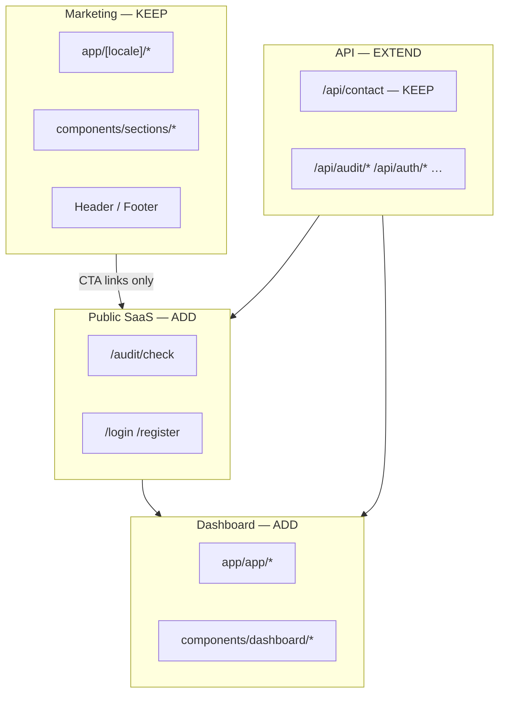

# Integration Roadmap — RankBoost.eu

> Как **постепенно встроить** SaaS из `MVP-Build-Plan.md` в существующий маркетинговый сайт из `Current-Code-Audit.md` — **не ломая** production-лендинг.
>
> Это не план «что писать», а план **куда и в каком порядке встраивать**, чтобы минимизировать регрессии и merge-конфликты.

**Связанные документы:** `Current-Code-Audit.md` · `MVP-Build-Plan.md` · `System-Architecture.md`

---

## 1. Главный принцип

```
┌─────────────────────────────────────────────────────────────┐
│  СУЩЕСТВУЮЩЕЕ — не трогать, пока промпт явно не разрешает  │
│  НОВОЕ — только в новых папках / новых route groups        │
│  ОБЩЕЕ — расширять (lib/, components/ui/), не переписывать  │
└─────────────────────────────────────────────────────────────┘
```

Маркетинговый сайт остаётся **работающим на каждом коммите**. SaaS добавляется **рядом**, как второй слой приложения в том же репозитории.

**Критерий готовности каждой фазы:** `npm run build` + ручная проверка `/ru`, `/et`, `/en`, `/contact`, `/blog` — без регрессий.

---

## 2. Целевая зонирование репозитория

После полной интеграции в одном Next.js-проекте живут **четыре зоны** с разными правилами изменений:

| Зона | URL | Папки | Правило |
|------|-----|-------|---------|
| **Marketing** | `/ru`, `/et`, `/en`, … | `app/[locale]/`, `components/sections/`, `components/layout/Header|Footer` | Минимальные точечные правки CTA |
| **Public SaaS** | `/audit/*`, `/register`, `/login` | `app/(public)/`, `components/audit/` | Новые файлы |
| **App (dashboard)** | `/app/*` | `app/app/`, `components/dashboard/`, `components/layout/App*` | Новые файлы |
| **Admin** | `/admin/*` | `app/admin/`, `components/admin/` | Новые файлы |
| **API** | `/api/*` | `app/api/**` | Добавлять routes; contact не трогать без нужды |
| **Shared** | — | `lib/`, `components/ui/`, `i18n/`, `app/globals.css` | Расширять, не ломать API существующих модулей |



---

## 3. Матрица: остаётся / меняется / добавляется / удаляется

### 3.1. Остаётся без изменений (на всём пути MVP)

| Что | Почему |
|-----|--------|
| `data/blog/posts/**` | 66 статей, SEO-трафик; MVP-Build-Plan запрещает трогать |
| `scripts/generate-blog-articles.mjs` | Генератор блога |
| `app/[locale]/blog/**` | Рабочий SSG + hreflang |
| `app/[locale]/services/page.tsx` | Agency services — отдельный контент от SaaS |
| `app/[locale]/privacy/page.tsx`, `terms/page.tsx` | Остаются до юридического обновления (фаза 24) |
| `app/sitemap.ts`, `app/robots.ts`, `app/opengraph-image.tsx` | SEO-инфраструктура |
| `components/blog/**` | Blog UI |
| `components/seo/JsonLdScript.tsx` | JSON-LD helper |
| `lib/seo.ts`, `lib/json-ld.ts` | Metadata helpers |
| `lib/i18n.ts`, `i18n/config.ts` | Locale routing helpers |
| `lib/utils.ts` | `cn()` |
| `POST /api/contact` | Рабочая lead-форма; параллельный канал с SaaS |
| `components/ui/button`, `input`, `badge`, … | shadcn base — расширять, не заменять |
| `app/layout.tsx` | Root fonts + GA (позже — consent wrapper) |

### 3.2. Меняется точечно (не переписывается целиком)

| Файл / область | Когда (блок MVP) | Характер изменения |
|----------------|------------------|-------------------|
| `middleware.ts` | 2.2 → 4.3 → 23.1 | **Добавить** ветки для `/app`, `/admin`, `/audit`; marketing-логика **не трогать** |
| `components/sections/Hero.tsx` | 5.1 | Добавить `SiteUrlForm`; сохранить layout и motion |
| `components/sections/CTASection.tsx` | 5.2 | Сменить `href` на audit flow |
| `components/layout/Header.tsx` | 5.2 | CTA «SEO-аудит» → `/audit/check` |
| `i18n/dictionaries/*.ts` | 2.2, 5.1, … | **Добавлять ключи** (`hero.auditCta`, `dashboard.*`); не рефакторить существующие |
| `app/globals.css` | 2.1 | **Добавить** CSS variables; не менять `.glass-card` |
| `app/sitemap.ts` | 6.3, 7.2 | Добавить `/audit/check` (если indexable) |
| `lib/validators.ts` | 6.1, 4.1 | **Новые схемы рядом** с `contactFormSchema` |
| `lib/resend.ts` | 20.1 | Расширить templates; contact flow не ломать |
| `.env.example` | 1.1, 1.2, 24.1 | Только дополнение переменных |
| `app/[locale]/pricing/page.tsx` | 9.x (опционально) | Вторичные CTA → Stripe; comparison table **остаётся** |
| `data/pricing.ts` | **До блока 9** | Синхронизация slug с Product-Bible **или** dual-source (см. §8) |
| `README.md` | 1.1, 24.1 | Документация |

### 3.3. Добавляется (весь объём SaaS)

| Категория | Примеры путей |
|-----------|---------------|
| Infra | `prisma/`, `lib/db.ts`, `lib/env.ts`, `lib/errors.ts` |
| Auth | `lib/auth/`, `app/(auth)/`, `app/api/auth/**` |
| Services | `lib/services/*-service.ts` |
| Audit funnel | `app/audit/`, `app/api/audit/**`, `components/audit/` |
| Dashboard | `app/app/**`, `components/dashboard/`, `AppSidebar`, `AppHeader` |
| Billing | `app/api/billing/**`, `app/api/webhooks/stripe/` |
| Hermes | `lib/hermes/`, `app/api/hermes/callback/` |
| Integrations | `app/api/integrations/**`, `lib/google/` |
| Admin | `app/admin/**`, `app/api/admin/**` |
| Email reports | `lib/email/`, `app/api/cron/**` |
| Security | `lib/security/ssrf.ts`, `lib/middleware/rate-limit.ts` |
| Docs ops | `docs/engineering/REPO-MAP.md`, `DEPLOYMENT.md` |

### 3.4. Удаляется (минимально, в конце или никогда)

| Что | Когда | Условие |
|-----|-------|---------|
| Временная `/app/dev/ui` | После 2.2 | Dev-only showcase из промпта 2.1 |
| Hermes stub / mock workers | После 14.1 | Замена на реальный worker |
| Дублирующие CTA на contact | После 5.2 | Contact **не удалять** — остаётся для agency leads |
| `local-boost` slug (опционально) | Блок 9 | Только после redirect map и Stripe sync |
| Agency-only pricing card copy | Post-launch | Не в MVP — marketing может показывать оба сообщения |

**Ничего из working marketing pages не удаляется в MVP.**

---

## 4. Порядок интеграции (фазы)

Каждая фаза = один или несколько блоков MVP-Build-Plan. После каждой — **gate**: build + smoke marketing.

### Фаза 0 — Freeze & map (блок 1.1)

**Цель:** зафиксировать границы до первой строки SaaS-кода.

| Действие | Риск для маркетинга |
|----------|---------------------|
| Создать `docs/engineering/REPO-MAP.md` | Нулевой |
| Дополнить `.env.example` | Нулевой |
| Зафиксировать pricing slug decision (§8) | Нулевой |

**Gate:** `npm run build` — 87 страниц, без изменений.

---

### Фаза 1 — Foundation parallel layer (блоки 1.2, 2.1, 2.2, 3.x)

**Стратегия:** вся инфраструктура **без UI на маркетинге**.

```
Добавить: prisma, lib/db, lib/env, lib/errors
Добавить: components/ui/score-gauge, task-card, …
Добавить: app/app/layout + placeholder page
Изменить: middleware — early return для /app
НЕ трогать: app/[locale]/**, Hero, pricing data
```

| Current-Code-Audit | MVP-Build-Plan | Интеграция |
|--------------------|----------------|------------|
| Нет Prisma | 3.1–3.3 | Новая папка `prisma/` |
| shadcn ui есть | 2.1 | Новые файлы в `components/ui/` |
| Нет `/app` | 2.2 | `app/app/` вне `[locale]` |
| middleware только locale | 2.2 | Добавить `if (pathname.startsWith('/app'))` **до** locale logic |

**Почему этот порядок:** DB и пустой dashboard не конфликтуют с 95 существующими файлами — **0 пересечений**.

**Gate:** `/ru` как раньше; `/app` — placeholder; migrations applied.

---

### Фаза 2 — Auth island (блок 4.x)

**Стратегия:** auth routes **вне** `[locale]`.

```
Добавить: app/(auth)/login, register
Добавить: app/api/auth/**
Добавить: lib/auth/*, LoginForm, RegisterForm (новые файлы)
Изменить: middleware — guard /app, /admin
НЕ трогать: ContactForm, Header nav structure
```

| Переиспользование без переписывания |
|-------------------------------------|
| `lib/validators.ts` — паттерн Zod + superRefine |
| `ContactForm` — copy patterns (honeypot, status, a11y) в `RegisterForm` |
| `components/ui/input`, `button`, `label` |
| `escapeHtml` — для email templates |

**Gate:** register → `/app` placeholder; `/ru/contact` form still works.

---

### Фаза 3 — First marketing touch (блок 5.x)

**Первая фаза с изменением существующих marketing-файлов.** Делать **отдельным PR** только для блока 5.

```
Изменить: Hero.tsx — добавить SiteUrlForm (не удалять HeroDashboard)
Изменить: CTASection, Header — href only
Добавить: components/forms/SiteUrlForm.tsx, lib/url/normalize.ts
Добавить: app/audit/check/page.tsx (пока без API — блок 6)
```

**Как не сломать Hero:**
- Не конвертировать Hero в server component
- Не убирать framer-motion
- `SiteUrlForm` — **дочерний** компонент, submit → navigate с query param

**Fallback:** если audit page не готова, CTA ведёт на `/audit/check` с «coming soon» — лучше чем битая ссылка.

**Gate:** все старые CTA на contact **либо** сохранены как secondary **либо** явно заменены по User-Flows §19; home build OK.

---

### Фаза 4 — Public audit funnel (блоки 6, 7, 8)

**Стратегия:** весь audit flow — **новые routes + API**, marketing только ссылается.

```
Добавить: app/api/audit/**, app/audit/**, components/audit/**
Добавить: lib/security/ssrf.ts, lib/services/audit-service.ts
Добавить: lib/auth/preview-token.ts
Изменить: RegisterForm — claimToken field
НЕ трогать: blog, services, contact API
```

| Current-Code-Audit gap | Решение при интеграции |
|------------------------|------------------------|
| Audit требует Website в DB | Создать ephemeral Website/PreviewSession в audit-service (решить в 6.1, не в marketing) |
| Нет rate limit | Добавить в 6.1 только для `/api/audit/*`; contact — в фазе 10 |

**Gate:** preview audit E2E; `/ru/blog` unchanged; contact form OK.

---

### Фаза 5 — Monetization (блок 9)

**Стратегия:** Stripe **рядом** с contact form, не вместо.

```
Добавить: app/api/billing/**, webhooks
Добавить: app/app/billing/page.tsx
Изменить (опционально): PricingCard — второй CTA «Subscribe» или replace primary CTA
НЕ удалять: getContactPath() flow для partner / custom
```

**Dual CTA на pricing (рекомендация):**

| План | Primary CTA | Secondary |
|------|-------------|-----------|
| start, growth, pro | Stripe Checkout | Contact для вопросов |
| partner | Contact (как сейчас) | — |

**Gate:** webhook на staging; marketing pricing page renders; agency contact still sends email.

---

### Фаза 6 — App core value (блоки 10–14)

**Стратегия:** вся ценность — в `app/app/**`; маркетинг **не участвует**.

```
Добавить: onboarding, dashboard, tasks, scores, Hermes client
Изменить: i18n — dashboard keys only
Переиспользовать: HeroDashboard.tsx как visual reference для ScoreGauge widgets
НЕ копировать: HeroDashboard code в dashboard — создать components/dashboard/* на базе 2.1
```

**HeroDashboard:** остаётся на лендинге как mock; dashboard использует **новые** `score-gauge`, `task-card` из фазы 1.

**Gate:** paid user: onboarding → dashboard; anonymous: marketing unchanged.

---

### Фаза 7 — Content & integrations (блоки 15–19)

**Стратегия:** только `app/app/content/*`, `app/api/integrations/*`.

Маркетинг и блог **не связаны** с generated articles (разные pipelines):

| Pipeline | Источник | Назначение |
|----------|----------|------------|
| Marketing blog | `data/blog/posts/` | SEO, статика |
| SaaS articles | DB + Hermes | Клиентский контент |

**Gate:** blog build time не вырос; `all-posts.ts` не изменён.

---

### Фаза 8 — Email, admin, economics (блоки 20–22)

```
Расширить: lib/resend.ts → lib/email/ (contact route imports from shared sender)
Добавить: app/admin/**, cron routes
НЕ трогать: contact HTML template inline в route.ts (refactor optional, not required)
```

**Resend integration:** extract `getResendClient()` usage to `lib/email/send.ts`; `contact/route.ts` becomes thin wrapper — **behavior identical**.

---

### Фаза 9 — Hardening & launch (блоки 23–24)

```
Изменить: middleware — rate limits
Изменить: privacy/terms dictionaries — SaaS sections
Изменить: next.config.ts — security headers
Добавить: CI workflow, DEPLOYMENT.md
Опционально: GA consent wrapper в app/layout.tsx
```

**Gate:** Definition of Done MVP-Build-Plan § Marketing — full regression checklist.

---

## 5. Сводная таблица: фаза → затронутые зоны

| Фаза | MVP блоки | Marketing | Shared | New zones |
|------|-----------|-----------|--------|-----------|
| 0 | 1.1 | — | .env.example | REPO-MAP |
| 1 | 1.2, 2.x, 3.x | — | globals.css, middleware | prisma, app/app |
| 2 | 4.x | — | middleware, validators | auth |
| 3 | 5.x | **Hero, Header, CTA** | i18n keys | audit page shell |
| 4 | 6–8 | — | validators | audit API, register claim |
| 5 | 9 | pricing CTA (opt.) | — | billing |
| 6 | 10–14 | — | i18n | dashboard, Hermes |
| 7 | 15–19 | — | — | content, google |
| 8 | 20–22 | — | resend | admin, cron |
| 9 | 23–24 | privacy/terms | middleware, layout | CI, deploy docs |

---

## 6. Как избежать больших merge-конфликтов

### 6.1. Правило владения файлами (CODEOWNERS mindset)

| Файл | Кто «владеет» в какой фазе | Конфликт с |
|------|---------------------------|------------|
| `middleware.ts` | Один PR на фазу; только **добавление** if-blocks сверху | Все фазы 1–2–4–9 |
| `i18n/dictionaries/*.ts` | Append-only keys; **не переименовывать** существующие | Параллельные фичи |
| `app/globals.css` | Только новые variables в конце `@theme` | Design system |
| `Hero.tsx` | Только фаза 3; freeze после merge | — |
| `package.json` | Фаза 1 (deps), потом редко | Любая работа |

### 6.2. Стратегия веток и PR

```
main ─────────────────────────────────────────────► production marketing
  │
  ├── feat/mvp-foundation     (фаза 1) ──merge──►
  ├── feat/mvp-auth           (фаза 2) ──merge──►
  ├── feat/mvp-landing-cta    (фаза 3) ──merge──►  ← единственный PR с Hero changes
  ├── feat/mvp-audit          (фаза 4) ──merge──►
  └── …
```

**Правила:**
1. **Один MVP-блок = один PR** (как в Build Plan)
2. PR **не смешивает** marketing UI и dashboard features
3. Перед merge: `npm run build` + checklist 3 locales
4. Rebase часто; не живить ветку > 3 дней на `middleware.ts`

### 6.3. Физическое разделение в git

| Приём | Эффект |
|-------|--------|
| Новые файлы вместо правки старых | 90% SaaS-кода — greenfield, конфликтов нет |
| `app/app/` vs `app/[locale]/` | Разные subtrees |
| `lib/services/` vs `lib/seo.ts` | Нет overlap |
| `components/dashboard/` vs `components/sections/` | Нет overlap |
| Append to dictionaries | Конфликты решаются тривиально |

### 6.4. Файлы-«горячие точки» — трогать редко и осознанно

| Hot file | Минимизация конфликтов |
|----------|------------------------|
| `middleware.ts` | Вынести логику в `lib/middleware/handlers/*.ts`; файл middleware — 15 строк re-exports |
| `i18n/dictionaries/ru.ts` | Split: `ru/marketing.ts` + `ru/dashboard.ts` + merge export (**фаза 1**, до параллельной работы) |
| `app/layout.tsx` | Обернуть GA в `<ConsentProvider>` без изменения children structure |
| `lib/validators.ts` | Split: `lib/validators/contact.ts`, `auth.ts`, `audit.ts` + barrel `index.ts` (**фаза 1.2**) |

> **Рекомендация фазы 1:** сделать split validators и middleware handlers **до** блока 4 — это единственная «проактивная» реструктуризация, снижающая конфликты. Поведение contact form **не меняется**.

---

## 7. Как не переписывать работающий код

### 7.1. Паттерн «Extend, don't replace»

| ❌ Не делать | ✅ Делать |
|-------------|----------|
| Переписать `ContactForm` в universal form | Новый `RegisterForm` с теми же UI primitives |
| Заменить `data/pricing.ts` на DB fetch на лендинге | Marketing static pricing + `lib/billing/plans.ts` для Stripe |
| Перенести blog в CMS в MVP | Оставить `all-posts.ts`; SaaS content в DB |
| Сделать единый layout для marketing + app | Два layout: `[locale]/layout.tsx` и `app/app/layout.tsx` |
| Конвертировать все sections в server components | Оставить client sections как есть |
| Удалить contact CTA | Dual funnel: audit (primary) + contact (secondary/partner) |

### 7.2. Переиспользование без копипасты бизнес-логики

| Существующий модуль | Как расширять |
|---------------------|---------------|
| `lib/validators.ts` | Новые export schemas; contact schema не менять |
| `lib/resend.ts` | Добавить `sendTransactional()`; contact route вызывает как сейчас |
| `lib/contact-links.ts` | Добавить `getAuditPath(url)` рядом |
| `getLocalizedPath()` | Использовать для marketing; `/app` без locale prefix |
| `generatePageMetadata()` | Все новые **marketing** pages; dashboard — свой metadata |
| `PricingCard` | Добавить optional prop `checkoutHref`; default = contact path |
| `ButtonLink` | Без изменений; новый `AppLink` для non-locale routes при необходимости |

### 7.3. i18n: два слоя строк

```
i18n/dictionaries/
  ru.ts          ← marketing (существует, 560+ строк)
  dashboard/ru.ts ← NEW: app UI only (фаза 2+)
```

**Альтернатива (меньше рефакторинга):** append `dashboard: { ... }` в существующие файлы — TypeScript заставит обновить et/en.

Marketing keys **никогда не переименовывать** — только добавлять.

---

## 8. Pricing: как не сломать маркетинг и Stripe одновременно

**Проблема из Current-Code-Audit:** `local-boost` / `growth` не совпадают с Product-Bible.

**Рекомендуемая стратегия dual-source (без big-bang rewrite):**

| Слой | Файл | Slugs | Используется |
|------|------|-------|--------------|
| Marketing display | `data/pricing.ts` | start, local-boost, growth, partner | Лендинг, comparison table |
| Billing truth | `lib/billing/plans.ts` (NEW) | start, growth, pro, audit | Stripe, PlanLimit |
| Mapping | `lib/billing/plan-mapping.ts` (NEW) | local-boost → growth | Checkout from marketing card |

**Фаза 5 (Stripe):** `PricingCard` передаёт `plan.id` → mapping → Stripe price.

**Фаза post-launch:** постепенно переименовать marketing slugs с 301 mental model (обновить `data/pricing.ts` + `contact-options.ts` в **одном PR**).

**Не делать в MVP:** подтягивать marketing pricing из DB — лишняя связность.

---

## 9. Middleware: эволюция без поломки locale routing

Текущий `middleware.ts` (из аудита):

1. Skip API, static, sitemap, robots
2. `/` → `/ru`
3. Нет locale → prepend `/ru`

**Целевая структура (additive):**

```ts
// Псевдокод — порядок важен
export function middleware(request) {
  const { pathname } = request.nextUrl;

  // 1. Unchanged: static/api bypass
  if (isStaticOrApi(pathname)) return next();

  // 2. NEW: SaaS zones without locale
  if (pathname.startsWith("/app")) return handleAppAuth(request);
  if (pathname.startsWith("/admin")) return handleAdminAuth(request);
  if (pathname.startsWith("/audit")) return next(); // public
  if (pathname.startsWith("/login") || pathname.startsWith("/register"))
    return handleAuthPages(request);

  // 3. UNCHANGED: marketing locale logic
  if (pathname === "/") return redirect(`/${defaultLocale}`);
  // ... existing locale checks
}
```

**Фаза 2.2:** только пункт 2 с `return next()` без auth.  
**Фаза 4.3:** добавить auth guard в handlers.  
**Marketing path never enters app handlers.**

---

## 10. API routes: расширение без изменения contact

```
app/api/
  contact/route.ts     ← FROZEN behavior after фаза 8 (optional thin refactor)
  auth/                ← NEW tree
  audit/               ← NEW
  billing/             ← NEW
  webhooks/stripe/     ← NEW
  hermes/callback/     ← NEW
  integrations/        ← NEW
  cron/                ← NEW
```

**Contact route contract:** request/response shape **не менять** — downstream integrations (email templates) могут зависеть.

Новые cross-cutting concerns (rate limit, error format) — через shared wrapper:

```ts
// lib/api/with-rate-limit.ts — opt-in per route
export const POST = withRateLimit(handler, { limit: 10, window: "1h" });
```

Contact подключается в фазе 9, audit — в фазе 4.

---

## 11. Тестирование как страховка от регрессий маркетинга

Current-Code-Audit: **0 тестов**. Добавлять incrementally:

| Фаза | Минимальные тесты | Защищают |
|------|-------------------|----------|
| 1 | `lib/env.ts` validation | Build on Vercel |
| 3 | Playwright: home loads 3 locales | Hero regression |
| 4 | API: audit preview SSRF cases | Security |
| 5 | Stripe webhook fixture test | Billing |
| 9 | Smoke: sitemap.xml contains /ru, /blog | SEO regression |

**Marketing smoke script (фаза 3):**

```
/ru, /et, /en → 200
/ru/contact → form visible
/ru/blog → list visible
POST /api/contact → 400 without body (not 500)
```

Добавить в CI на фазе 9 — до этого manual gate после каждого PR.

---

## 12. Mapping: MVP-Build-Plan → Integration phases

| MVP блок | Integration фаза | Трогает marketing? |
|----------|------------------|-------------------|
| 1.1 Audit & REPO-MAP | 0 | Нет |
| 1.2 Dependencies | 1 | Нет |
| 2.1 Dashboard UI | 1 | Нет (только globals.css vars) |
| 2.2 App shell | 1 | Нет (middleware +/app) |
| 3.1–3.3 Prisma | 1 | Нет |
| 4.1–4.3 Auth | 2 | Нет |
| 5.1–5.2 Landing CTA | **3** | **Да** |
| 6–8 Audit + register | 4 | Нет |
| 9 Stripe | 5 | Опционально pricing CTA |
| 10–14 Onboarding, dashboard, Hermes | 6 | Нет |
| 15–19 Content, Google | 7 | Нет |
| 20–22 Email, admin | 8 | Нет |
| 23–24 Security, deploy | 9 | privacy/terms, layout |

---

## 13. Чеклист «маркетинг не сломан» (каждый merge)

- [ ] `npm run build` — success, ~87+ static pages (число растёт только за счёт audit pages)
- [ ] `/ru`, `/et`, `/en` — home renders Hero + Pricing section
- [ ] `/ru/contact` — form submits (staging with Resend)
- [ ] `/ru/blog` + one article — OK
- [ ] `/sitemap.xml` — contains locale alternates
- [ ] `/api/contact` — validation + honeypot work
- [ ] No console errors on marketing pages (browser)
- [ ] Header/Footer links resolve (no 404)

---

## 14. Риски интеграции и mitigation

| Риск | Mitigation |
|------|------------|
| Hero refactor ломает LCP | Фаза 3 — отдельный PR; не трогать HeroDashboard |
| middleware ломает /ru | Handlers file; тест 3 locales после каждого change |
| pricing slug mismatch | dual-source + mapping до Stripe live |
| `all-posts.ts` merge hell | MVP-Build-Plan: не трогать; никаких PR в blog data |
| Параллельная работа 2 devs | Разные зоны: один — app/api, другой — audit; не оба в Hero |
| Bundle size рост | dashboard deps не import в marketing sections |
| Contact spam до rate limit | Фаза 9; interim Cloudflare on /api/contact |

---

## 15. Итог: одна фраза на фазу

| # | Фраза |
|---|-------|
| 0 | Зафиксировать карту, не писать продуктовый код |
| 1 | Насыпать foundation **рядом** с лендингом |
| 2 | Auth island без locale |
| 3 | **Единственная** существенная правка маркетинга — CTA → audit |
| 4 | Public funnel целиком в новых папках |
| 5 | Stripe рядом с contact, не вместо |
| 6 | Dashboard = greenfield в `app/app/` |
| 7 | Клиентский контент ≠ marketing blog |
| 8 | Resend shared, admin isolated |
| 9 | Hardening + legal + CI |

**Существующий сайт остаётся ядром SEO и доверия. SaaS — надстройка с отдельными routes, которая подключается к лендингу через CTA и pricing, не через переписывание.**

---

*Версия 1.0 · Июнь 2026 · Согласовано с Current-Code-Audit.md и MVP-Build-Plan.md v1.0*
